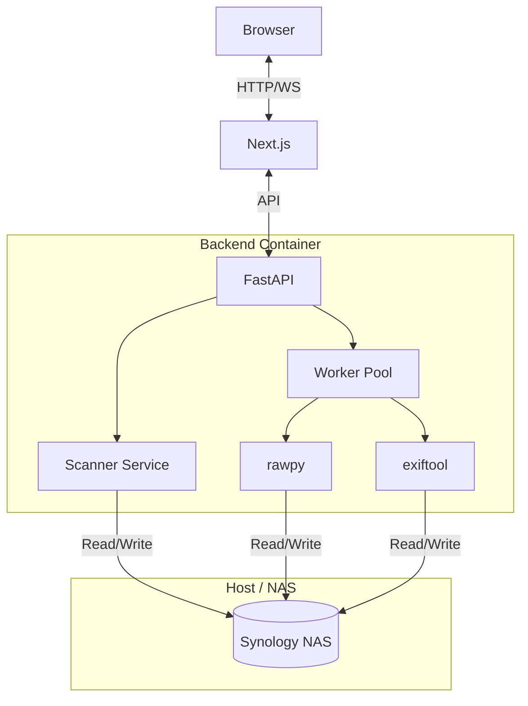

# 🏗️ Project Blueprint: Spectrum (v2.0)

**A unified guide to the requirements, design, architecture, and implementation plan.**

> **Goal:** Create a professional-grade, frictionless ARW → JPEG converter for high-volume photography workflows on NAS storage.

---

## 1. 📋 Requirements & Persona

### **User Persona: Michi**
- **Role:** Professional Photographer.
- **Problem:** Processes thousands of Sony RAW files on a Synology NAS. Current tools are slow, lose metadata, and provide zero feedback during long waits.
- **Critical Need:** "Set it and forget it" reliability with **Zero Data Loss**.

### **Functional Requirements**
- **Core Conversion:**
  - [x] Convert `.ARW` to JPEG (Quality: 100%).
  - [x] **Preserve EXIF:** Keep ALL metadata (GPS, Camera Settings, Dates).
  - [x] **Skip Existing:** Don't re-convert files if JPEG exists.
- **File System:**
  - [x] **Recursive Scan:** Handle nested NAS folders.
  - [x] **Output:** Create `converted/` subfolder in source directory.
  - [x] **Atomic Writes:** Write to `.tmp`, rename to `.jpg` to prevent corruption.
- **UI/UX:**
  - [x] **Real-time Feedback:** Progress bar, Speed (files/sec), ETA.
  - [x] **Simple Setup:** Docker-based "one click" start.

---

## 2. 📍 UX Journey Map

**Context:** NAS latency means directory listings are slow. The UI must be optimistic and reassuring.

### **The User Flow**
1.  **Setup:** User runs `start.sh` -> Browser opens `localhost:3000`.
2.  **Select:** User picks a source folder (e.g., `/Volumes/Photos/2024-Wedding`).
3.  **Scan:** System quickly previews: "Found 450 ARW files. 10 already converted."
4.  **Execute:** User clicks "Start".
    - **Visuals:** Progress bar fills, file names flicker by.
    - **Stats:** "2.4 images/sec • 8 mins remaining".
5.  **Finish:** "🎉 Done! 440 images converted." -> Button to open folder.

### **Solving Friction**
- **"Is it frozen?"** -> Heartbeat UI (pulsing indicators) + Live Speedometer.
- **Network Drop?** -> Robust error handling + Resume capability (skip finished).
- **Corrupt File?** -> Isolate error, log it, and continue batch.

---

## 3. 🏗️ Architecture & Stack

**Philosophy:** "Local Execution, SaaS DNA."
Currently deployed as a local Docker app, but architected to lift-and-shift to the cloud.

### **Tech Stack**
- **Deployment:** **Docker Compose** (Cross-platform Mac/Win/Lin).
- **Frontend:** **Next.js 14** (React, TypeScript, Tailwind).
- **Backend:** **FastAPI** (Python 3.12, Async).
- **Core:** **rawpy** (LibRaw C++ binding) + **exiftool** (Metadata).
- **Comms:** **WebSockets** (Real-time updates).

### **System Diagram**

### **SaaS Readiness**
- **Stateless Core:** Logic accepts byte streams/paths, unaware of "local disk".
- **Adapters:** Storage is wrapped in `StorageAdapter` (Local vs S3).
- **Queues:** Internal `asyncio.Queue` can be swapped for `Redis`+`Celery`.

---

## 4. 📅 Implementation Plan (3-Day Sprint)

### **Phase 1: Infrastructure & Core (Day 1)**
- [ ] **Init:** Repo setup, `docker-compose.yml`, structure.
- [ ] **Backend:** FastAPI setup, `ScannerService` (recursive), `ConverterService` (rawpy).
- [ ] **Exif:** `exiftool` wrapper service.
- [ ] **Output:** API endpoint `/convert` working for one file.

### **Phase 2: UI & Real-time (Day 2)**
- [ ] **Frontend:** `FolderPicker` component, Main Dashboard.
- [ ] **WebSockets:** FastAPI `/ws/progress` + React `useProgress` hook.
- [ ] **Polish:** Stop/Cancel logic, Error logging UI.

### **Phase 3: Delivery (Day 3)**
- [ ] **Hardening:** Cross-platform volume test (Win vs Mac).
- [ ] **Scripts:** `start.sh` / `start.bat`.
- [ ] **Docs:** README with Screenshots, Portfolio write-up.
- [ ] **Ship:** Zip file ready for Michi.

---

**Definition of Done:** User unzips -> Runs script -> Converts 500 files -> Smiles.
